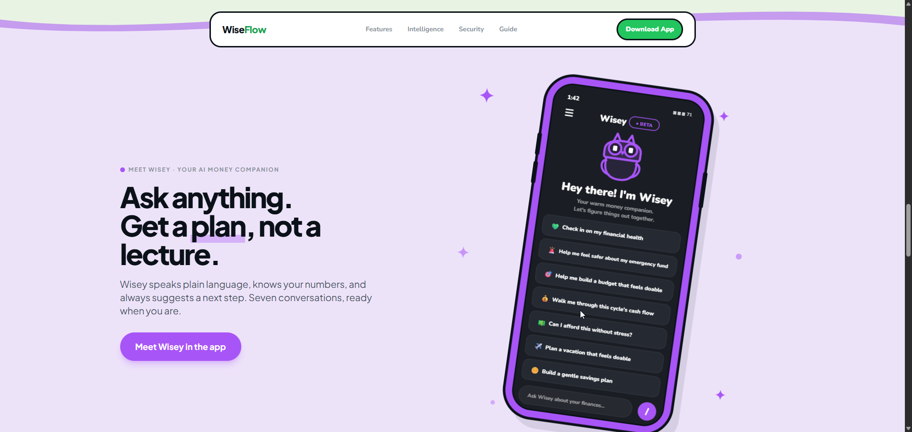
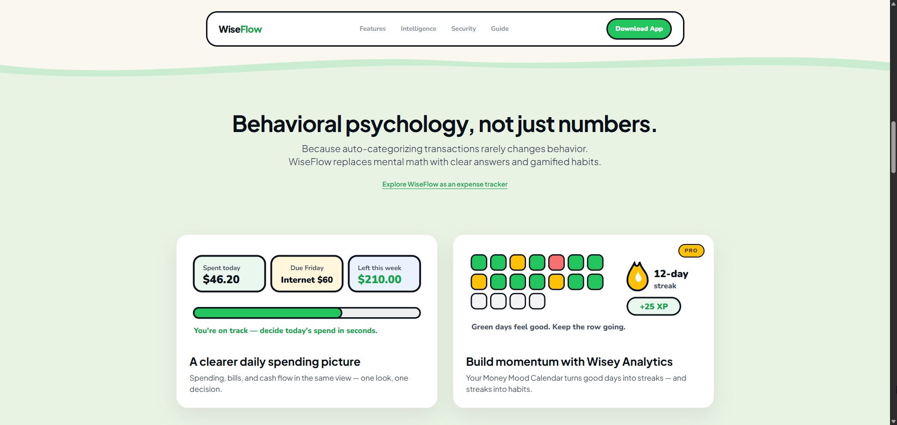
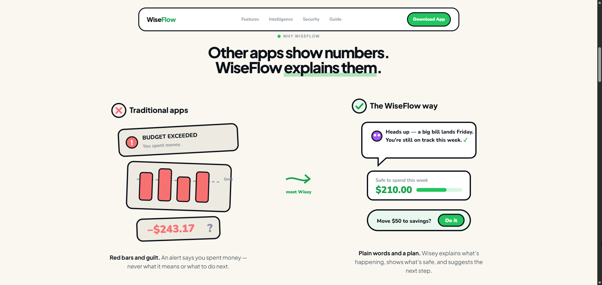
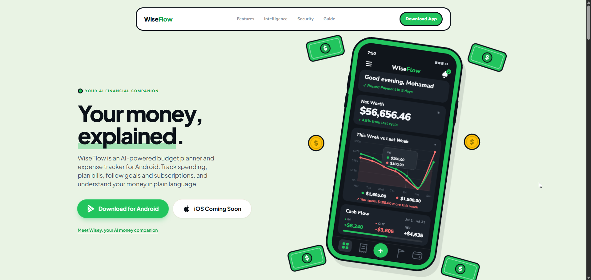
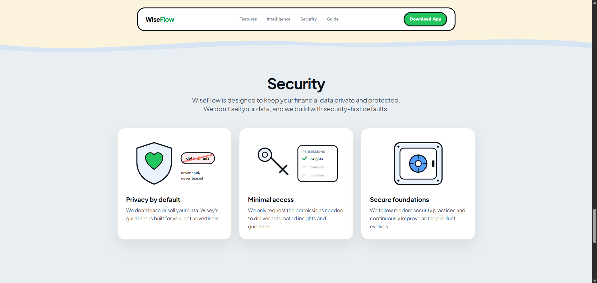

<h1 align="center">WiseFlow — Official Web Application & Landing Page</h1>

<p align="center">
  <b>The official web application and marketing platform for WiseFlow (<a href="https://wiseflowapp.com">wiseflowapp.com</a>).</b>
</p>

<p align="center">
  
  
  
  
  
</p>

---

## 📸 Production Interface Screenshots

<p align="center">
  
</p>

<p align="center">
  
  
</p>

<p align="center">
  
  
</p>

---

## ⚡ Features & Performance Benchmarks

| Lighthouse Performance | First Contentful Paint | UI Frame Rate |
| :---: | :---: | :---: |
| 💯 99 / 100 | 🚀 &lt; 120ms | ⚡ 60 FPS GSAP Motion |

| Real-Time Financial Dashboard | Bank Integration & Analytics |
| :--- | :--- |
| 📊 Multi-wallet balance aggregation | 💳 Plaid & TrueLayer transaction sync |
| 📉 Interactive spending trend analytics | ⚡ GSAP-driven responsive animations |

---

## 🏗️ Architecture & Engineering

- **Frontend Core**: React 18 with custom hook-driven state management.
- **Micro-Animations**: GSAP timeline animations and scroll trigger interactions.
- **Styling Architecture**: Tailored Tailwind CSS variables with zero-runtime utility optimization.
- **Edge Deployment**: Pre-configured Netlify build pipeline with HTTP/2 server push.

---

## 🛠️ Local Development Setup

```bash
# Clone repository
git clone https://github.com/WiseFlow-dev/wiseflow-web-landing.git

# Install dependencies
npm install

# Start Vite dev server
npm run dev

# Build production bundle
npm run build
```

---

## 📄 License

MIT License © [WiseFlow](https://wiseflowapp.com)
